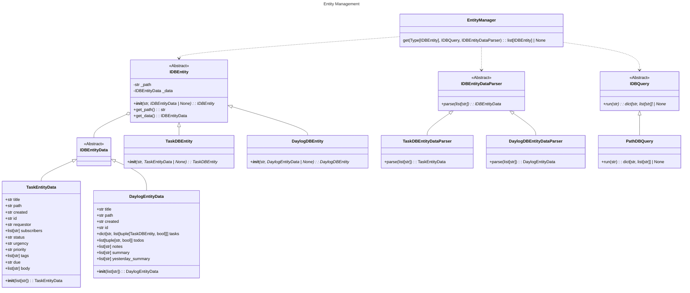

```mermaid
---
title: Entity Management
---

classDiagram


  class IDBEntityData{
    <<Abstract>>
  }

  IDBEntityData <|-- TaskEntityData
  class TaskEntityData {
    +str title
    +str path
    +str created
    +str id
    +str requestor
    +list[str] subscribers
    +str status
    +str urgency
    +str priority
    +list[str] tags
    +str due
    +list[str] body

    +__init__(list[str]): TaskEntityData
  }

  IDBEntityData <|-- DaylogEntityData
  class DaylogEntityData {
    +str title
    +str path
    +str created
    +str id
    +dict[str, list[tuple[TaskDBEntity, bool]]] tasks
    +list[tuple[str, bool]] todos
    +list[str] notes
    +list[str] summary
    +list[str] yesterday_summary


    +__init__(list[str]): DaylogEntityData
  }

  IDBEntity o-- IDBEntityData

  class IDBEntity {
    <<Abstract>>
    -str _path
    -IDBEntityData _data

    +__init__(str, IDBEntityData | None): IDBEntity*
    +get_path(): str
    +get_data(): IDBEntityData
  }


  IDBEntity <|-- TaskDBEntity
  class TaskDBEntity {
    +__init__(str, TaskEntityData | None): TaskDBEntity*
  }

  IDBEntity <|-- DaylogDBEntity
  class DaylogDBEntity {
    +__init__(str, DaylogEntityData | None): DaylogDBEntity*
  }

  class IDBEntityDataParser {
    <<Abstract>>
    +parse(list[str]): IDBEntityData*
  }

  IDBEntityDataParser <|-- TaskDBEntityDataParser
  class TaskDBEntityDataParser {
    +parse(list[str]): TaskEntityData
  }

  IDBEntityDataParser <|-- DaylogDBEntityDataParser
  class DaylogDBEntityDataParser {
    +parse(list[str]): DaylogEntityData
  }

  class IDBQuery{
    <<Abstract>>
    +run(str): dict[str, list[str]] | None*
  }

  IDBQuery <|-- PathDBQuery
  class PathDBQuery{
    +run(str): dict[str, list[str]] | None
  }


  EntityManager ..> IDBEntity
  EntityManager ..> IDBQuery
  EntityManager ..> IDBEntityDataParser

  class EntityManager{
    get(Type[IDBEntity], IDBQuery, IDBEntityDataParser): list[IDBEntity] | None
  }

```
