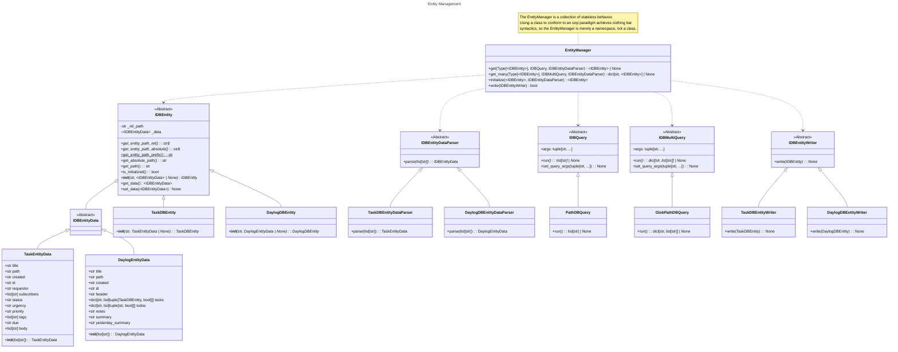

```mermaid
---
title: Entity Management
---

classDiagram

  class IDBEntityData{
    <<Abstract>>
  }

  IDBEntityData <|-- TaskEntityData
  class TaskEntityData {
    +str title
    +str path
    +str created
    +str id
    +str requestor
    +list[str] subscribers
    +str status
    +str urgency
    +str priority
    +list[str] tags
    +str due
    +list[str] body

    +__init__(list[str]): TaskEntityData
  }

  IDBEntityData <|-- DaylogEntityData
  class DaylogEntityData {
    +str title
    +str path
    +str created
    +str id
    +str header
    +dict[str, list[tuple[TaskDBEntity, bool]]] tasks
    +dict[str, list[tuple[str, bool]]] todos
    +str notes
    +str summary
    +str yesterday_summary


    +__init__(list[str]): DaylogEntityData
  }

  IDBEntity o-- IDBEntityData

  class IDBEntity~IDBEntityData~ {
    <<Abstract>>
    -str _rel_path

    +get_entity_path_rel(): str$*
    +get_entity_path_absolute(): str$*
    +get_entity_path_prefix(): str$
    +get_absolute_path(): str
    +get_path(): str
    +is_initialized(): bool
  }
  IDBEntity : -~IDBEntityData~ _data
  IDBEntity : +__init__(str, ~IDBEntityData~ | None) IDBEntity*
  IDBEntity : +get_data() ~IDBEntityData~
  IDBEntity : +set_data(~IDBEntityData~) None

  IDBEntity <|-- TaskDBEntity
  class TaskDBEntity {
    +__init__(str, TaskEntityData | None): TaskDBEntity*
  }

  IDBEntity <|-- DaylogDBEntity
  class DaylogDBEntity {
    +__init__(str, DaylogEntityData | None): DaylogDBEntity*
  }

  class IDBEntityDataParser {
    <<Abstract>>
    +parse(list[str]): IDBEntityData*
  }

  IDBEntityDataParser <|-- TaskDBEntityDataParser
  class TaskDBEntityDataParser {
    +parse(list[str]): TaskEntityData
  }

  IDBEntityDataParser <|-- DaylogDBEntityDataParser
  class DaylogDBEntityDataParser {
    +parse(list[str]): DaylogEntityData
  }

  class IDBQuery{
    <<Abstract>>
    +args: tuple[str, ...]

    +run(): list[str] | None*
    +set_query_args(tuple[str, ...]): None
  }

  IDBQuery <|-- PathDBQuery
  class PathDBQuery{
    +run(): list[str] | None
  }

  class IDBMultiQuery{
    <<Abstract>>
    +args: tuple[str, ...]

    +run(): dict[str, list[str]] | None*
    +set_query_args(tuple[str, ...]): None
  }

  IDBMultiQuery <|-- GlobPathDBQuery
  class GlobPathDBQuery{
    +run(): dict[str, list[str]] | None
  }

  class IDBEntityWriter{
    <<Abstract>>
    +write(IDBEntity): None*
  }

  IDBEntityWriter <|-- TaskDBEntityWriter
  class TaskDBEntityWriter{
    +write(TaskDBEntity): None
  }

  IDBEntityWriter <|-- DaylogDBEntityWriter
  class DaylogDBEntityWriter{
    +write(DaylogDBEntity): None
  }

  EntityManager ..> IDBEntity
  EntityManager ..> IDBQuery
  EntityManager ..> IDBMultiQuery
  EntityManager ..> IDBEntityDataParser
  EntityManager ..> IDBEntityWriter

  note for EntityManager "The EntityManager is a collection of stateless behavior. 
    Using a class to conform to an oop paradigm achieves nothing bar 
    syntactics, so the EntityManager is merely a namespace, not a class."

  class EntityManager{
  }

  EntityManager :  +get(Type[~IDBEntity~], IDBQuery, IDBEntityDataParser) ~IDBEntity~ | None
  EntityManager : +get_many(Type[~IDBEntity~], IDBMultiQuery, IDBEntityDataParser) dict[str, ~IDBEntity~] | None
  EntityManager : +initialize(~IDBEntity~, IDBEntityDataParser) ~IDBEntity~
  EntityManager : +write(IDBEntityWriter) bool

```
